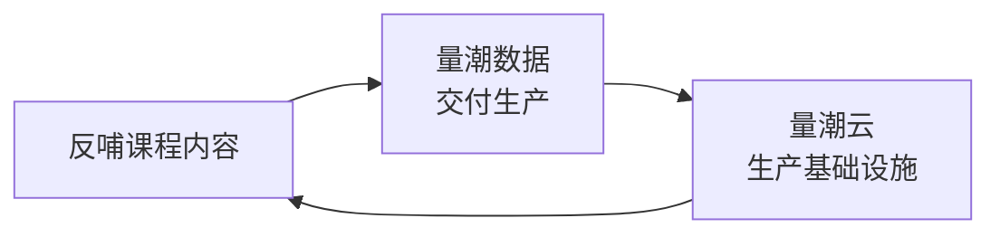

# 量潮业务版图

量潮不是一家公司做几个业务，是一个体系：以第二大脑为地基，各业务共享一套范式，互相供给。量潮是创新基础设施的提供商——量潮云提供生产平台，量潮课堂提供知识和经验，量潮数据提供交付能力。

## 业务线

- **量潮数据**：招牌业务。数据服务，把零散的数据变成可用的信息资产。本质是技术管理——需求拆解、过程管控、质量兜底，不靠个人能力，靠制度和工具
- **量潮课堂**：人才供给与教育。自学工具，以学生为中心；课堂同时是筛选器和生产力工厂，实践课与考核同构、生产实习与试用期同构，产教融合闭环。课堂也是创新孵化器的支撑：支撑创新的连续性，让大家不断把结果固化出来
- **量潮云**：生产基础设施。目标是帮助人类消除人机协作摩擦的第二大脑，按领域划分各云：资产云、执行云、写作云、客服云、创新管理
- **量潮招聘**：已并入课堂。招聘的筛选功能被「课堂加实训」天然替代——实训效率高于实习，课堂效率高于招聘时，课堂就具备规模化基础
- **量潮咨询**：定制服务。基于标准化体系提供服务，客户提供更清楚的标准化体系，我们就能更好地服务
- **量潮众包**：通用众包平台，双边市场。与一品威客式任务撮合市场的差异：交易的是标准不是人——需求拆解为标准任务，执行方按量潮标准交付，验收准则兜底。核心协同：用 qtcrowd 给 qtdata 筛选导流——执行方在通用市场按量潮标准交易积累信用，达标者进入 qtdata 认证供应商池。与量潮数据的三方体系意图一致：客户、执行方、平台方各取所需
- **量潮开源**：开源连接平台，量潮与市场开源体系融合打通的连接点——开发者朋友的开源项目与量潮第二大脑（标准、章程、工具、案例）双向贡献、互相依赖、共同演进，量潮自身也建立在市场开源体系之上。开源的本质是外部参与，标准在融合中被市场验证。与量潮云配对：云是后台生产，qtopen 是开源连接前台
- **量潮产品**：产品黄页，对标 Product Hunt 的产品发布与发现平台——产品在此发布、被发现、被排行、被讨论。收录量潮自己的产品与开发者朋友的产品，与 qtopen 呼应：开源连接让项目被看见，产品黄页让产品被看见。可见性即资产，产品被发现是增长的第一环
- **量潮商务**：服务黄页，展示没有产品形态的定制服务与解决方案——数据服务、咨询、定制开发。与 qtproduct 构成产品与服务双黄页：qtproduct 收录有产品的，qtbusiness 收录没产品的，覆盖量潮全部供给形态。服务是量潮的基本盘，解决方案是项目案例的沉淀形态
- **量潮学术**：学术黄页，展示学者朋友们的论文、研究项目与学术成果——研究在此发布、被发现、被引用、被讨论。与量潮数据呼应：核心客户是高校经管科研工作者，研究产生数据需求、数据服务支撑研究。可见性系列的一环：代码（qtopen）→ 产品（qtproduct）→ 服务（qtbusiness）→ 研究（qtacademics）
- **量潮创新联盟**：联盟官网，介绍量潮的盟友们——合作方、开发者朋友、学者朋友、执行方等生态成员在此被介绍、被看见。被量潮介绍即被验证，联盟是盟友的信用徽章。可见性系列的收官一环：代码→产品→服务→研究→盟友

## 双引擎

商业公司由两个引擎驱动：**增长**是市场、增加收入；**管理**是降本增效、控制成本。人事和财务分别促进对应决策、提高招聘质量。通用商业工具（客户关系、商务、销售、人事、财务）是云业务的大头，与 Salesforce 对齐。

## 业务咬合

- 课堂培养的人进入数据业务，实训基地生产力同时供给课堂和数据两条线
- 数据把项目标准化上云，用现成客户群做种子，实现云转型
- 云承载生产流程，课堂的数据回流反哺课程内容
- 全部业务共享第二大脑：工作案例提炼工作札记，再提炼工作手册和工程标准

## 统一目标

各业务共享同一套范式：从工作案例出发，用 AI 总结记录，把经验固化成结构。软件交付成本在急剧下降，真正的成本在需求供应——这也是所有业务共同要消除的摩擦。
